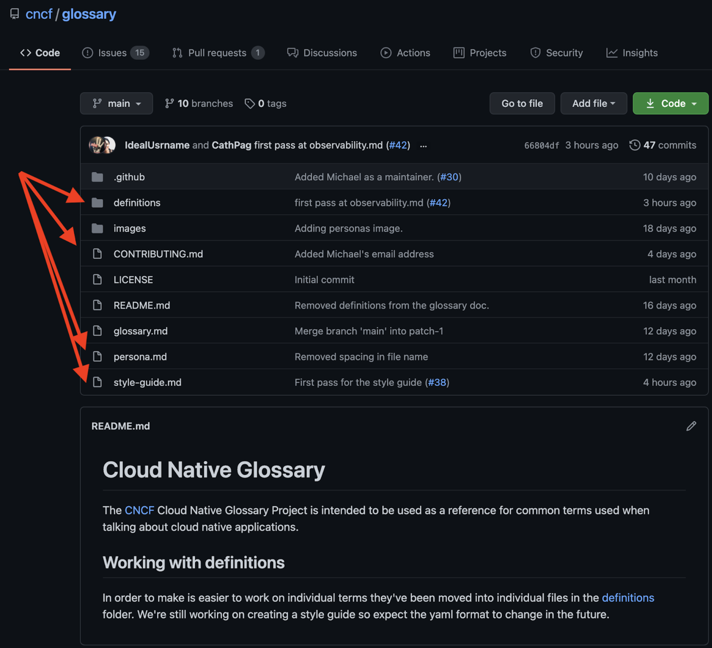
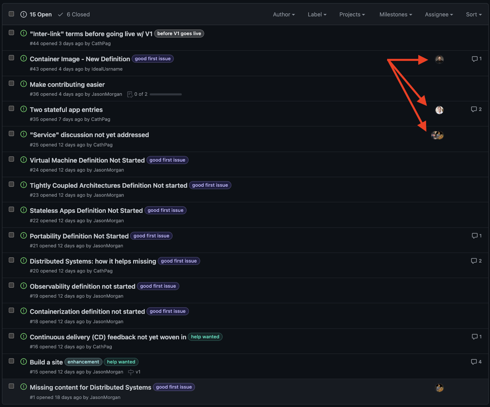
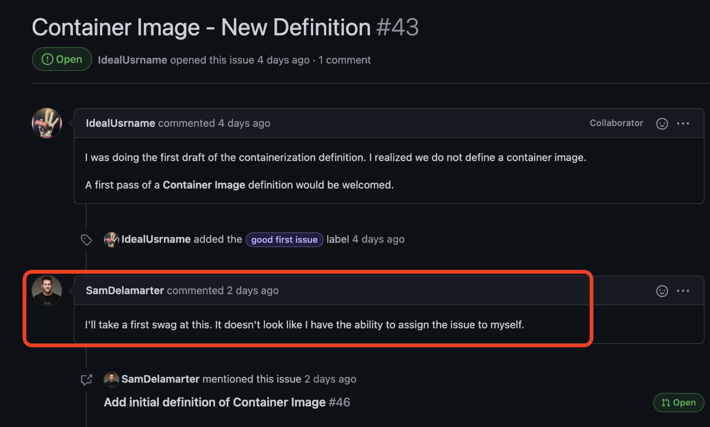

# How to navigate this GitHub page and submit a PR
## The lading page
The landing page can be found on github.com/cncf/glossary. The most important sections are:
- **Definitions:** all definitions that are part of the glossary in separate files, including a template for new terms,
- **Contributing:** info about the project, how to contribute, and project guidelines,
- **Persona:** the persona this glossary is targeting,
- **Style guide:** format and style of glossary entries.

## Navigate the page using the tabs
To navigate this page, use the tabs. Most relevant to you are:
- **Issues:** tasks that have been flagged and help is needed,
- **Pull requests (PR):** once you created a pull request is should appear here (more to PRs below),
- **Discussions:** where conversations about the project take place. You can participate or start a new one.

## Issues
In the "issues" tab, you'll find current open issues. Issues are tasks that have been identified. Most relevant to you are those with a "good first issue" or "help wanted" tag. Some have already been assigned to people (see arrows). 

Before getting started, make sure someone else didn't "claim" that issue already. Click on the issue to learn more about it. In this case, someone already claimed the container image term, so pick a different issue.

# Updating a glossary term (aka submitting a PR)
Now, let's update a glossary entry. Go to the [definitions page:](https://github.com/cncf/glossary/tree/main/definitions)
1. Select your term
2. Click on edit
3. Update the term
4. Create a new branch 
5. Create a pull request

Check out this screen recording:

 
After successfully submitting your PR, you should see it here:

Didn't work? Please reach out on Slack in the marketing-business-value channel. We'll be happy to help! 
